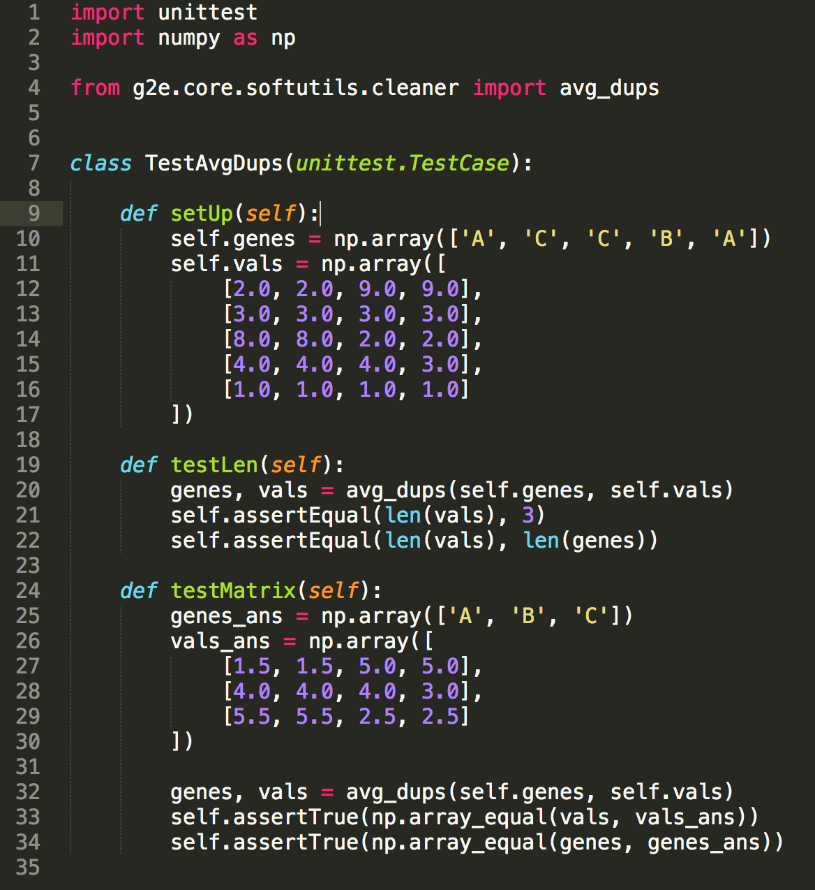

# Unit testing
_Gregory Gundersen, Ma'ayan Lab meeting, 22 January 2015_

## Basics of unit testing
> **What is a unit test?**

A unit test verifies that an individual unit of code works as expected.

> **What is a "unit"?**

A testable part of your program, typically a function, because possible larger.

> **Why should I unit test?**

Here are just a few reasons:
- **Stability:** Running unit tests before you deploy verifies that the code in production is similar to the code you are about to deploy.
- **Modularization:** Writing unit tests encourages you to think of and write code as units.
- **Scalability:** Developing a large codebase among multiple developers is nearly impossible without at least some testing. In fact, your code already benefits from modularization and unit testing. For example, when you use `pandas`, you benefit from the fact that someone else writes code that they test.
- Wikipedia has a nice [list of benefits](https://en.wikipedia.org/wiki/Unit_testing#Benefits).

> **When should I write unit tests?**

We are not a software engineering team, and there are not any expectations for unit testing. Bny tests you write are better than none. Some guidelines:

- **When the code is mission critical,** such as a complex algorithm that performs an essential computational step. For example, you don't want to perform differential expression analysis, and get the Characteristic Direction wrong.
- **When you find a bug.** Think of it as penance for releasing code that does not work as expected. This is a kind of [boyscount refactoring](http://programmer.97things.oreilly.com/wiki/index.php/The_Boy_Scout_Rule).

> **When can you change a failing test?**

When the unit's interface was intentionally changed. You should **never** change a failing unit test because you do not know why it is failing or because you're fed up with it failing.

## Examples

Example test suite


Example unit test



## Setup in Python

You will need
- `unittest`: this is a built-in Python module.
- `pip` - If you don't have pip, use [this script](https://bootstrap.pypa.io/get-pip.py) to download it. Run `python get-pip.py` after downloading the script.
- `nose` - [nose](https://nose.readthedocs.org/en/latest/) is a small program for easily running Python unit tests. Once you have pip installed, run `pip install nose`.
- This repo has some unit tests already stubbed out. Run `git clone https://github.com/MaayanLab/unittesting.git` to clone the repo to your current directory.

### Unittest module
`unittest` is a built-in Python module for writing unit tests. A test case is created by subclassing `unittest.TestCase`. For example:

```python
import unittest

class TestStringMethods(unittest.TestCase):

    def test_upper(self):
        self.assertEqual('foo'.upper(), 'FOO')
        
    ...
```

### Running the tests using `nose`
- Navigate to working directory
- Type `nosetests`
- nose will run any tests inside files with a "test" (case insensitive) prefix
- Use `-v` to see test names and output

## Let's write some tests

[`numbers`](https://github.com/MaayanLab/software-testing/blob/master/1-unit-testing/numbers.py) is a small Python "library" for numerical computing. We're going to test the library's two functions, `is_odd()` and `is_prime()`.

### is_odd()
First, let's fill out the [tests for `is_odd`](https://github.com/MaayanLab/software-testing/blob/master/1-unit-testing/test_is_odd.py). Use the `self.assert*` methods to make assertions about the output of the unit based on the input. For example:

```python
# This test should pass
self.assertTrue(is_odd(3))
```

At any point, type `nosetests` to check if your test is passing.

### is_prime()
Next, let's fill out the [tests for `is_prime()`](https://github.com/MaayanLab/software-testing/blob/master/1-unit-testing/test_is_prime.py). This time, the function has a small bug. It does not work as expected. Fill out the unit tests, and you should see one of them fail.

This highlights how it is often easier to reason about how a unit *should work* rather than how it *does work*. We all know the basic definition of a prime number, but it can be easy to write code that does not do what we think, because we do not check the edge cases.

### Testing Enrichr's API

For a less trivial example, we have some [stubbed out tests](https://github.com/MaayanLab/software-testing/blob/master/1-unit-testing/test_enrichr.py) for verifying that Enrichr's API works as expected. Enrichr's API has two relevant methods:

> **`POST /Enrichr/addList`:** Accepts a POST request with a newline-separated list of gene symbols and a description. Returns a `userListId` identifying the uploaded gene list.

> **`GET /Enrichr/view?dataset={userListId}`:** Returns a list of genes associated with a `userListId`. 

Notice the function `setUp`. The `unittest.TestCase` instance will automatically call this function before every unit test. Thus, the call stack for `TestEnrichr` is:

    setUp
    testResponseHasUserListId
    setUp
    testResponseHasShortId
    setUp
    testInputAgainstOutput

## Caveats
- A passing test does not mean the code is correct.
- Unit tests do not replace functional tests. A functional test tests a slice of functionality of the whole software system, based on the specificationss.
- Taking the time to write tests will never be prioritized. You should do it for your own peace of mind. And for your users.
